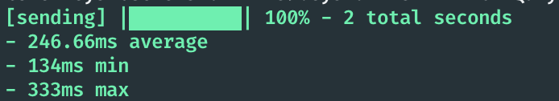

# PerfCli
**PerfCli is a basic command-line application written in dart to test the response time of a backend URL.**




Developed with 💙 by Apparence.io

## Installing 
```
dart pub global activate percli
```

## Test an url with 100 parallel requests
```
dart run bin/perfcli.dart -u http://myurl.com  -t 100
```

## Test an url with 100 parallel requests for 10 seconds
```
dart run bin/perfcli.dart -u http://myurl.com  -t 100 -r 100
```

## Show help 
Creates only html version
```
dart pub global run perfcli -h
```

## Run (uncompiled version)
Creates only html version
```
dart run bin/perfcli.dart --help
```

## Compile  
```
dart compile exe bin/perfcli.dart
```

